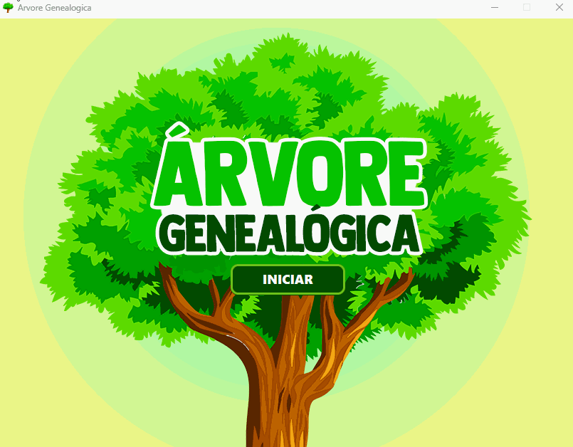

# Árvore genealógica - Thread

 Este projeto foi concebido e implementado como parte da disciplina de Programação Concorrente, realizada durante o terceiro semestre do curso de Ciência da Computação na Universidade Estadual do Sudoeste da Bahia (UESB), fazendo uso da linguagem de programação Java.

# Sobre

 O objetivo central deste projeto é criar um algoritmo que simule a construção de uma árvore genealógica, uma proposta apresentada pelo professor da disciplina, usando threads como parte do processo de implementação.

 # Execução

# Autores
[@CarlosGilM](https://github.com/CarlosGilM)
